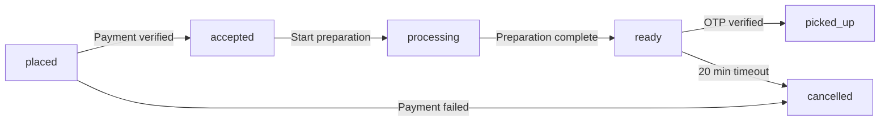

## Overview

Allows store employees to move an order through its lifecycle stages. Each status transition is validated to ensure orders follow the correct workflow.

When an order is marked as `ready`, a 6-digit OTP is automatically generated and sent to the customer via email and push notification.

## Authentication

Requires authentication with JWT token. **Only available to `store_employee` role.**

## Endpoint

```
PATCH /api/orders/:id/status
```

## Path parameters

<ParamField path="id" type="string" required>
  The unique order ID (MongoDB ObjectId)
</ParamField>

## Request body

<ParamField body="status" type="string" required>
  The new order status
  
  Valid transitions:
  - `placed` → `accepted`
  - `accepted` → `processing`
  - `processing` → `ready`
  - `ready` → `picked_up`
</ParamField>

## Response

<ResponseField name="success" type="boolean">
  Indicates if the order status was updated successfully
</ResponseField>

<ResponseField name="message" type="string">
  Human-readable status message
</ResponseField>

<ResponseField name="data" type="object">
  <Expandable title="Response data">
    <ResponseField name="order" type="object">
      The updated order with complete details
    </ResponseField>
    
    <ResponseField name="otp" type="string">
      6-digit OTP (only returned when status changes to `ready`)
    </ResponseField>
  </Expandable>
</ResponseField>

## Order lifecycle



## Status transition rules

### placed → accepted

- Payment status must be `success`
- If customer has no-show history (watch/restricted tier), `isCommitmentConfirmed` must be `true`
- Customer receives "Order Accepted" notification

### accepted → processing

- Store starts preparing the order
- Customer receives "Order Being Prepared" notification

### processing → ready

- Order preparation is complete
- **6-digit OTP is generated** and sent to customer
- `readyAt` timestamp is set
- `readyExpiresAt` is set to 20 minutes from now
- Customer must collect order within 20 minutes or it's marked as no-show
- Customer receives "Order Ready for Pickup" notification with OTP

### ready → picked_up

- OTP must be verified first using [POST /api/orders/:id/verify-otp](/api/orders/verify-otp)
- Customer receives "Order Collected" notification

<Warning>
You cannot mark an order as `picked_up` without verifying the OTP first. Use the verify OTP endpoint to complete this transition.
</Warning>

## Example request

<CodeGroup>
```bash cURL (Accept Order)
curl -X PATCH https://api.campusbite.com/api/orders/65f7a8b9c1234567890abcde/status \
  -H "Authorization: Bearer STORE_JWT_TOKEN" \
  -H "Content-Type: application/json" \
  -d '{
    "status": "accepted"
  }'
```

```bash cURL (Mark Ready)
curl -X PATCH https://api.campusbite.com/api/orders/65f7a8b9c1234567890abcde/status \
  -H "Authorization: Bearer STORE_JWT_TOKEN" \
  -H "Content-Type: application/json" \
  -d '{
    "status": "ready"
  }'
```

```javascript JavaScript
const orderId = '65f7a8b9c1234567890abcde';
const response = await fetch(
  `https://api.campusbite.com/api/orders/${orderId}/status`,
  {
    method: 'PATCH',
    headers: {
      'Authorization': `Bearer ${storeToken}`,
      'Content-Type': 'application/json'
    },
    body: JSON.stringify({
      status: 'processing'
    })
  }
);

const data = await response.json();
```
</CodeGroup>

## Example response (ready status)

```json
{
  "success": true,
  "message": "Order status updated to \"ready\".",
  "data": {
    "order": {
      "id": "65f7a8b9c1234567890abcde",
      "orderNumber": "ORD-20240318-001",
      "orderStatus": "ready",
      "paymentStatus": "success",
      "totalAmount": 249.50,
      "items": [
        {
          "menuItemId": "65f7a8b9c1234567890abcdf",
          "name": "Paneer Burger",
          "price": 120,
          "quantity": 1,
          "total": 120
        }
      ],
      "readyAt": "2024-03-18T14:45:00.000Z",
      "readyExpiresAt": "2024-03-18T15:05:00.000Z",
      "isOtpVerified": false,
      "customer": {
        "id": "65f7a8b9c1234567890abce6",
        "name": "Rahul Sharma",
        "email": "rahul.sharma@college.edu"
      },
      "store": {
        "id": "65f7a8b9c1234567890abce2",
        "name": "Campus Cafe"
      },
      "createdAt": "2024-03-18T14:30:00.000Z",
      "updatedAt": "2024-03-18T14:45:00.000Z"
    },
    "otp": "573842"
  }
}
```

## Error responses

<Expandable title="400 - Invalid status transition">
```json
{
  "success": false,
  "message": "Cannot transition from \"placed\" to \"ready\"."
}
```
</Expandable>

<Expandable title="400 - Commitment required">
```json
{
  "success": false,
  "message": "Customer must confirm they are on the way before this order can be accepted."
}
```
</Expandable>

<Expandable title="400 - OTP not verified">
```json
{
  "success": false,
  "message": "OTP must be verified before marking as picked up."
}
```
</Expandable>

<Expandable title="403 - Not authorized">
```json
{
  "success": false,
  "message": "You are not authorized to update this order."
}
```
</Expandable>

<Expandable title="404 - Order not found">
```json
{
  "success": false,
  "message": "Order not found."
}
```
</Expandable>

## OTP generation details

When transitioning to `ready` status:

- 6-digit numeric OTP is generated
- OTP expires in **10 minutes** (configurable)
- OTP is sent via:
  - Email to customer
  - Push notification to customer's devices
- OTP is returned in the API response for store's reference
- Store must verify this OTP when customer arrives

<Note>
The OTP is only included in the response when the status changes to `ready`. It is not returned for other status transitions.
</Note>

## Commitment confirmation

Customers with no-show history must confirm their commitment before stores can accept orders:

- **Trust tier: good** - No commitment required
- **Trust tier: watch** - Commitment required if no-show count ≥ 2
- **Trust tier: restricted** - Always requires commitment

If commitment is required but not confirmed, the store receives an error when trying to accept the order.