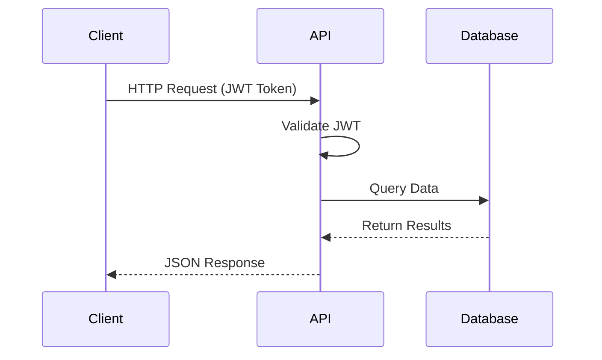

CampusBite is a full-stack campus food ordering platform built with modern web technologies. The system follows a client-server architecture with clear separation between frontend and backend layers.

## System architecture

The platform consists of three main layers:

<CardGroup cols={3}>
  <Card title="Frontend layer" icon="browser">
    React-based SPA with Vite and Tailwind CSS
  </Card>
  <Card title="Backend layer" icon="server">
    Express.js REST API with JWT authentication
  </Card>
  <Card title="Database layer" icon="database">
    MongoDB with Mongoose ODM
  </Card>
</CardGroup>

### Communication flow

All client-server communication happens through REST APIs with JSON payloads:



## Core design principles

### Role-based access control

The system supports three user roles with distinct permissions:

- **Student/Faculty**: Browse stores, place orders, track deliveries
- **Store Employee**: Manage menu, process orders, verify OTP pickups
- **System**: Automated tasks like order timeouts and no-show tracking

Authentication is enforced via JWT tokens with automatic refresh. The `authenticate` middleware verifies tokens on protected routes (backend/src/middleware/auth.js:5).

<Note>
  Authorization checks use the `authorize(...roles)` middleware to restrict endpoints by role (backend/src/middleware/auth.js:49).
</Note>

### Data flow patterns

CampusBite implements several key data flow patterns:

<Accordion title="Authentication flow">
  1. User submits credentials to `/api/auth/login`
  2. Backend validates credentials and generates JWT access + refresh tokens
  3. Frontend stores tokens in localStorage
  4. Axios interceptor attaches JWT to all subsequent requests
  5. On 401 response, interceptor automatically refreshes token
  6. If refresh fails, user is redirected to login

  See frontend/src/lib/api.js:28 for the refresh interceptor implementation.
</Accordion>

<Accordion title="Order placement flow">
  1. Customer adds items to cart (stored in React Context)
  2. On checkout, frontend sends POST to `/api/orders`
  3. Backend creates order with `pending` payment status
  4. System generates UPI deep link for payment
  5. Customer pays via UPI app
  6. Store employee manually confirms payment
  7. Order progresses through states: placed → accepted → processing → ready
  8. OTP generated when order marked ready
  9. Customer shows OTP for pickup verification
</Accordion>

<Accordion title="Real-time updates">
  The system uses two mechanisms for real-time updates:
  
  - **HTTP polling**: Frontend polls `/api/orders/:id/poll-status` every 3 seconds for order status updates
  - **Server-Sent Events (SSE)**: Stores receive SSE notifications at `/api/notifications` for new orders
  
  SSE is registered before rate limiters to allow persistent connections (backend/src/index.js:72).
</Accordion>

### Security measures

The backend implements multiple security layers:

<CardGroup cols={2}>
  <Card title="Helmet.js" icon="shield">
    Sets security-related HTTP headers
  </Card>
  <Card title="CORS" icon="globe">
    Restricts origins to configured frontend URLs
  </Card>
  <Card title="Rate limiting" icon="gauge">
    Three-tier strategy: global, auth, and per-user order limits
  </Card>
  <Card title="JWT tokens" icon="key">
    Access tokens (1h) + refresh tokens (7d) with auto-refresh
  </Card>
</CardGroup>

<Note>
  Rate limiting uses a campus-aware strategy with high IP limits (3000 req/15min) since all students share a few NAT-ted campus WiFi IPs. Individual abuse is caught via user-keyed order limits (backend/src/index.js:84).
</Note>

### Campus-specific features

#### OTP-based pickup verification

To prevent order fraud, CampusBite generates a 6-digit OTP when orders are marked ready. The customer must show this OTP to the store for pickup verification.

#### No-show tracking

The system tracks customers who don't pick up ready orders:

- Orders have a pickup window (30 minutes by default)
- If not picked up, customer's `no_show_count` increments
- After 3 no-shows, user is restricted from ordering temporarily
- Trust tiers: `good` → `watch` → `restricted`

#### UPI payment integration

India-specific payment flow using UPI deep links:

- Backend generates payment links for GPay, PhonePe, Paytm, BHIM
- Links open native UPI apps on mobile devices
- Store manually confirms payment receipt (no payment gateway integration)

## Deployment architecture

CampusBite supports multiple deployment configurations:

### Development mode

```
Terminal 1: Backend on localhost:5000
Terminal 2: Frontend on localhost:5173 (Vite dev server)
```

Vite proxies `/api` requests to the backend automatically.

### Production mode

The backend serves the built frontend as static files:

```
/                    → Serve frontend/dist/index.html
/api/*               → API endpoints
/public/uploads/*    → User-uploaded images
```

See backend/src/index.js:171 for the production static file serving setup.

<Note>
  For production deployments with file uploads, mount a persistent volume at `/data/uploads` to prevent uploaded images from disappearing on container restarts.
</Note>

## Next steps

<CardGroup cols={2}>
  <Card title="Tech stack" href="/architecture/tech-stack" icon="layer-group">
    Explore the technologies and dependencies used
  </Card>
  <Card title="Project structure" href="/architecture/project-structure" icon="folder-tree">
    Understand the codebase organization
  </Card>
</CardGroup>