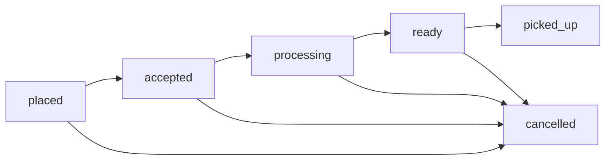

CampusBite implements a sophisticated order tracking system that manages the entire lifecycle from placement to pickup, including automatic timeout handling and trust-based commitment requirements.

## Order lifecycle

Orders progress through six distinct states:



| Status | Description | Who Updates |
|--------|-------------|-------------|
| `placed` | Order created, awaiting payment verification | System |
| `accepted` | Payment confirmed, store accepts order | Store employee |
| `processing` | Store is preparing the order | Store employee |
| `ready` | Order is ready for customer pickup | Store employee |
| `picked_up` | Customer collected the order | Store employee (via OTP) |
| `cancelled` | Order cancelled (payment failed, timeout, or no-show) | System or store |

<Note>
The system enforces strict state transitions. For example, an order cannot jump from `placed` directly to `ready` - it must progress through `accepted` and `processing` first.
</Note>

## Creating orders

The order creation process involves a two-step checkout flow for security and accuracy.

<Steps>
  <Step title="Create checkout session">
    Generate a temporary checkout token containing cart details and payment information.
  </Step>
  
  <Step title="Complete payment">
    Customer pays via UPI to the store's UPI ID.
  </Step>
  
  <Step title="Submit order">
    Customer submits the checkout token with their transaction ID to create the order.
  </Step>
  
  <Step title="Store verifies payment">
    Store employee manually confirms payment and updates payment status.
  </Step>
</Steps>

### Checkout session

```javascript backend/src/controllers/orderController.js
export const createCheckoutSession = async (req, res, next) => {
  try {
    const userId = req.user.id;
    const { items, storeId, specialInstructions } = req.body;
    await runOrderTimeoutSweep();

    // Check if user is restricted
    const user = await User.findById(userId).select(
      'no_show_count trust_tier ordering_restricted_until',
    );

    const restrictionDate = user.ordering_restricted_until
      ? new Date(user.ordering_restricted_until)
      : null;
    if (restrictionDate && restrictionDate > new Date()) {
      return res.status(403).json({
        success: false,
        message: `Ordering is temporarily restricted due to repeated no-shows until ${restrictionDate.toLocaleString()}.`,
      });
    }

    // Validate cart and calculate total
    const draft = await buildOrderDraft({
      items,
      storeId,
      specialInstructions,
    });

    // Generate unique payment reference
    const paymentReference = await generateUniquePaymentReference();

    // Create checkout token (expires in 15 minutes)
    const checkoutToken = jwt.sign(
      {
        userId,
        storeId: draft.store._id.toString(),
        items: draft.normalizedItems,
        specialInstructions: draft.specialInstructions,
        totalAmount: draft.totalAmount,
        paymentReference,
      },
      CHECKOUT_TOKEN_SECRET,
      { expiresIn: CHECKOUT_TOKEN_EXPIRY_SECONDS },
    );

    // Generate UPI links
    const upiLink = generateUpiLink(
      draft.store.upi_id,
      draft.store.name,
      draft.totalAmount,
      paymentReference,
    );

    res.json({
      success: true,
      message: "Direct store UPI checkout initiated. Pay the exact amount to the store UPI ID to continue.",
      data: {
        checkoutToken,
        paymentReference,
        expiresInSeconds: CHECKOUT_TOKEN_EXPIRY_SECONDS,
        store: {
          id: draft.store._id.toString(),
          name: draft.store.name,
          upiId: draft.store.upi_id,
        },
        items: draft.orderItems,
        totalAmount: draft.totalAmount,
        payment: {
          upiLink,
          amount: draft.totalAmount,
          paymentReference,
        },
      },
    });
  } catch (error) {
    next(error);
  }
};
```

### Order creation

```javascript backend/src/controllers/orderController.js
export const createOrder = async (req, res, next) => {
  try {
    const userId = req.user.id;
    const { checkoutToken, transactionId } = req.body;

    // Verify checkout token
    let checkoutData;
    try {
      checkoutData = jwt.verify(checkoutToken, CHECKOUT_TOKEN_SECRET);
    } catch {
      return res.status(400).json({
        success: false,
        message: "Checkout session expired or invalid. Please retry payment.",
      });
    }

    // Check for duplicate payment reference
    const existingOrder = await Order.findOne({
      payment_reference: checkoutData.paymentReference,
    })
      .populate("store_id")
      .lean();

    if (existingOrder) {
      return res.json({
        success: true,
        message: "Order already placed for this payment reference.",
        data: formatOrder(existingOrder, { store: existingOrder.store_id }),
      });
    }

    // Validate cart again (prices may have changed)
    const draft = await buildOrderDraft({
      items: checkoutData.items || [],
      storeId: checkoutData.storeId,
      specialInstructions: checkoutData.specialInstructions,
    });

    if (Math.abs(draft.totalAmount - Number(checkoutData.totalAmount || 0)) > 0.01) {
      return res.status(409).json({
        success: false,
        message: "Cart details changed during payment. Please retry checkout with updated cart.",
      });
    }

    // Create order
    const order = await Order.create({
      order_number: generateOrderNumber(),
      payment_reference: checkoutData.paymentReference,
      user_id: userId,
      store_id: draft.store._id,
      items: draft.orderItems,
      total_amount: draft.totalAmount,
      payment_status: "pending",
      payment_method: "direct_store_upi",
      transaction_id: transactionId || null,
      special_instructions: draft.specialInstructions,
      is_commitment_confirmed: false,
      commitment_deadline_at: nowPlusMinutes(ORDER_COMMITMENT_TIMEOUT_MINUTES),
    });

    res.status(201).json({
      success: true,
      message: "Order placed. Complete payment and let the store verify before preparation.",
      data: formatOrder(order, { store: draft.store }),
    });
  } catch (error) {
    next(error);
  }
};
```

<Warning>
The checkout token expires in 15 minutes. If the token expires, you must create a new checkout session. This prevents stale cart data from being used to create orders.
</Warning>

## Order status updates

Store employees update order status as they process orders. The system validates each state transition.

```javascript backend/src/controllers/orderController.js
export const updateOrderStatus = async (req, res, next) => {
  try {
    const { id } = req.params;
    const userId = req.user.id;
    const { status } = req.body;

    // Define valid transitions
    const validTransitions = {
      placed: ["accepted"],
      accepted: ["processing"],
      processing: ["ready"],
      ready: ["picked_up"],
    };

    const order = await Order.findById(id)
      .populate("store_id")
      .populate("user_id", "name email no_show_count trust_tier");

    if (!order) {
      return res.status(404).json({
        success: false,
        message: "Order not found.",
      });
    }

    // Verify store ownership
    if (order.store_id.owner_id.toString() !== userId) {
      return res.status(403).json({
        success: false,
        message: "You are not authorized to update this order.",
      });
    }

    // Validate transition
    const allowedNextStatuses = validTransitions[order.order_status];
    if (!allowedNextStatuses || !allowedNextStatuses.includes(status)) {
      return res.status(400).json({
        success: false,
        message: `Cannot transition from "${order.order_status}" to "${status}".`,
      });
    }

    // Check commitment for watch/restricted users
    if (status === "accepted" && order.order_status === "placed") {
      const trustTier = getUserTrustTier(order.user_id);
      const requiresCommitment =
        trustTier !== "good" ||
        toSafeInt(order.user_id.no_show_count, 0) >= NO_SHOW_WARNING_THRESHOLD;
      if (requiresCommitment && !order.is_commitment_confirmed) {
        return res.status(400).json({
          success: false,
          message: "Customer must confirm they are on the way before this order can be accepted.",
        });
      }
    }

    // Generate OTP when marking as ready
    let generatedOtp = null;
    if (status === "ready") {
      generatedOtp = generateOtp();
      order.otp = generatedOtp;
      order.otp_expires_at = getOtpExpiry();
      order.is_otp_verified = false;
      order.ready_at = new Date();
      order.ready_expires_at = nowPlusMinutes(READY_NO_SHOW_TIMEOUT_MINUTES);
    }

    order.order_status = status;
    await order.save();

    // Send email and push notification
    await sendOrderStatusUpdate(
      order.user_id.email,
      order.user_id.name,
      formatOrder(order),
      status,
    );

    if (status === "ready" && generatedOtp) {
      await sendOtpEmail(
        order.user_id.email,
        order.user_id.name,
        generatedOtp,
        order.order_number,
      );
    }

    pushOrderNotification(order.user_id._id, order, status);

    res.json({
      success: true,
      message: `Order status updated to "${status}".`,
      data: {
        order: formatOrder(order, { store: order.store_id, customer: order.user_id }),
      },
    });
  } catch (error) {
    next(error);
  }
};
```

<Accordion title="Valid status transitions">
- `placed` → `accepted`: Store confirms payment
- `accepted` → `processing`: Store starts preparing
- `processing` → `ready`: Order is complete and ready for pickup
- `ready` → `picked_up`: Customer collects order (requires OTP verification)

Any status except `picked_up` can transition to `cancelled`.
</Accordion>

## Automatic timeout sweeps

The system runs automatic cleanup operations to cancel stale orders and apply no-show penalties.

```javascript backend/src/controllers/orderController.js
const runOrderTimeoutSweep = async () => {
  const now = Date.now();
  if (now - lastSweepTimestamp < SWEEP_MIN_INTERVAL_MS) return;
  lastSweepTimestamp = now;

  // Cancel unpaid orders after 8 minutes (default)
  const staleUnpaidOrders = await Order.find({
    order_status: "placed",
    payment_status: "pending",
    created_at: { $lte: nowMinusMinutes(UNPAID_ORDER_TIMEOUT_MINUTES) },
  }).select("_id");

  if (staleUnpaidOrders.length > 0) {
    const staleIds = staleUnpaidOrders.map((order) => order._id);
    await Order.updateMany(
      { _id: { $in: staleIds } },
      {
        $set: {
          order_status: "cancelled",
          cancelled_at: new Date(),
          cancellation_reason: "payment_timeout",
          payment_status: "failed",
        },
      },
    );
  }

  // Cancel ready orders not collected within 20 minutes (default)
  const staleReadyOrders = await Order.find({
    order_status: "ready",
    is_otp_verified: false,
    ready_expires_at: { $ne: null, $lte: new Date() },
  }).select("_id user_id no_show_recorded");

  for (const order of staleReadyOrders) {
    await Order.updateOne(
      { _id: order._id },
      {
        $set: {
          order_status: "cancelled",
          cancelled_at: new Date(),
          cancellation_reason: "no_show_timeout",
          no_show_recorded: true,
        },
      },
    );

    if (!order.no_show_recorded) {
      await applyNoShowPenalty(order.user_id);
    }
  }
};
```

<Note>
The timeout sweep runs at most once every 30 seconds to avoid excessive database queries. It's triggered automatically on most order-related operations.
</Note>

### Timeout configuration

You can configure timeout durations via environment variables:

| Variable | Default | Description |
|----------|---------|-------------|
| `UNPAID_ORDER_TIMEOUT_MINUTES` | 8 | Cancel orders with pending payment |
| `READY_NO_SHOW_TIMEOUT_MINUTES` | 20 | Cancel ready orders not collected |
| `ORDER_COMMITMENT_TIMEOUT_MINUTES` | 4 | Time limit for commitment confirmation |

## Customer commitment system

Users with a history of no-shows must confirm they're on their way before the store starts preparing their order.

### Trust tiers

```javascript backend/src/controllers/orderController.js
const getUserTrustTier = (userDoc) => {
  const restrictionDate = userDoc?.ordering_restricted_until
    ? new Date(userDoc.ordering_restricted_until)
    : null;
  if (restrictionDate && restrictionDate > new Date()) return "restricted";
  const noShowCount = toSafeInt(userDoc?.no_show_count, 0);
  if (noShowCount >= NO_SHOW_WARNING_THRESHOLD) return "watch";
  return "good";
};
```

| Tier | Criteria | Requirements |
|------|----------|-------------|
| **good** | 0-1 no-shows | No additional requirements |
| **watch** | 2+ no-shows | Must confirm commitment before store accepts |
| **restricted** | 3+ no-shows | Cannot place orders for 14 days (default) |

### Confirming commitment

```javascript backend/src/controllers/orderController.js
export const confirmOrderCommitment = async (req, res, next) => {
  try {
    const { id } = req.params;
    const userId = req.user.id;

    const order = await Order.findById(id)
      .populate("store_id")
      .populate("user_id", "name email");

    if (!order) {
      return res.status(404).json({
        success: false,
        message: "Order not found.",
      });
    }

    if (order.user_id._id.toString() !== userId) {
      return res.status(403).json({
        success: false,
        message: "You are not authorized to confirm commitment for this order.",
      });
    }

    order.is_commitment_confirmed = true;
    order.commitment_confirmed_at = new Date();
    order.commitment_deadline_at = null;
    await order.save();

    res.json({
      success: true,
      message: "Commitment confirmed. Store can proceed with preparation.",
      data: { order: formatOrder(order) },
    });
  } catch (error) {
    next(error);
  }
};
```

<Warning>
If a customer in the "watch" or "restricted" tier doesn't confirm commitment within the deadline (4 minutes default), the store cannot accept their order. This prevents food waste from no-shows.
</Warning>

## Real-time polling

Customers can poll for order status updates to track their order in real-time.

```javascript backend/src/controllers/orderController.js
export const pollOrderStatus = async (req, res, next) => {
  try {
    await runOrderTimeoutSweep();
    const { id } = req.params;
    const userId = req.user.id;
    const role = req.user.role;

    const order = await Order.findById(id).lean();

    if (!order) {
      return res.status(404).json({ success: false, message: "Order not found." });
    }

    // Verify authorization
    if (role === "store_employee") {
      const store = await Store.findOne({ owner_id: userId }).lean();
      if (!store || store._id.toString() !== String(order.store_id)) {
        return res.status(403).json({
          success: false,
          message: "You are not authorized to view this order.",
        });
      }
    } else if (String(order.user_id) !== userId) {
      return res.status(403).json({
        success: false,
        message: "You are not authorized to view this order.",
      });
    }

    res.json({ success: true, data: formatOrder(order) });
  } catch (error) {
    next(error);
  }
};
```

<Note>
The polling endpoint uses `.lean()` queries for better performance since it doesn't need to modify the documents. This reduces memory overhead and query time.
</Note>

## Order data structure

```javascript backend/src/models/Order.js
const orderSchema = new mongoose.Schema({
  order_number: { type: String, required: true, unique: true, index: true },
  payment_reference: { type: String, required: true, unique: true, index: true },
  user_id: { type: mongoose.Schema.Types.ObjectId, ref: 'User', required: true, index: true },
  store_id: { type: mongoose.Schema.Types.ObjectId, ref: 'Store', required: true, index: true },
  items: { type: [orderItemSchema], default: [] },
  total_amount: { type: Number, required: true },
  payment_status: { type: String, enum: ['pending', 'success', 'failed'], default: 'pending' },
  order_status: { type: String, enum: ['placed', 'accepted', 'processing', 'ready', 'picked_up', 'cancelled'], default: 'placed' },
  payment_method: { type: String, default: 'upi' },
  transaction_id: { type: String, default: null, index: true },
  special_instructions: { type: String, default: null },
  is_commitment_confirmed: { type: Boolean, default: false },
  commitment_confirmed_at: { type: Date, default: null },
  commitment_deadline_at: { type: Date, default: null },
  ready_at: { type: Date, default: null },
  ready_expires_at: { type: Date, default: null },
  cancelled_at: { type: Date, default: null },
  cancellation_reason: { type: String, default: null },
  no_show_recorded: { type: Boolean, default: false },
  otp: { type: String, default: null },
  otp_expires_at: { type: Date, default: null },
  is_otp_verified: { type: Boolean, default: false },
});
```

## API endpoints

| Endpoint | Method | Description | Auth |
|----------|--------|-------------|------|
| `/api/orders/checkout` | POST | Create checkout session | Customer |
| `/api/orders` | POST | Create order from checkout | Customer |
| `/api/orders` | GET | List orders (filtered by role) | Any |
| `/api/orders/:id` | GET | Get order details | Owner/Store |
| `/api/orders/:id/payment-status` | PATCH | Update payment status | Store |
| `/api/orders/:id/status` | PATCH | Update order status | Store |
| `/api/orders/:id/commitment` | POST | Confirm customer commitment | Customer |
| `/api/orders/:id/poll` | GET | Poll order status | Owner/Store |